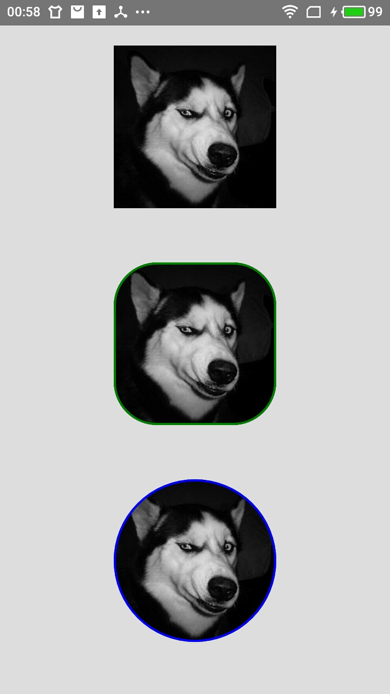

# Image组件

## 加载网络图片

```
<View>
  <Image source={
    {uri:'http://www.123.com/123.png'
    }
  }/>
</View>
```
>**[warning] Image一定要设置图片的大小，否则不显示**

## 加载静态图片

```
···
  const imageUrl = 'http://www.123.com/123.png'
···
<View>
  <Image source={require({imgeUrl})}/>
</View>
```
>**[warning] Image一定要设置图片的大小，否则不显示**

## 加载资源文件中的图片

```
···
const nativeImageSource = require('nativeImageSource');
···
<View>
  <Image source={nativeImageSource(imgeUrl)}/>
</View>
```
>**[warning] Image一定要设置图片的大小，否则不显示**

## Image样式

### cover

> Image充满整个定义的区域，对图片放大和缩小，舍弃放大或者缩小后的部分区域

### contain

> 显示整张图片，可等比放大缩小，不能丢弃改变后的部分

### strech

> 要求填充这个Image定义的区域，不保持原来的宽高比

### center

> 要求图片位于显示区域的中心

### repeat

> 用一张或者多张来填充个整个Image区域

## Image其他属性

> `onLoadStart`、`onLoadEnd`、`onLode`、`onError`函数，四个个回调函数中都有event参数

## Image缓存

> cache 属性的缓存策略：有only-if-cached，default，reload，与force-cache见名知意

## Image简易使用效果图

<center>
  
</center>