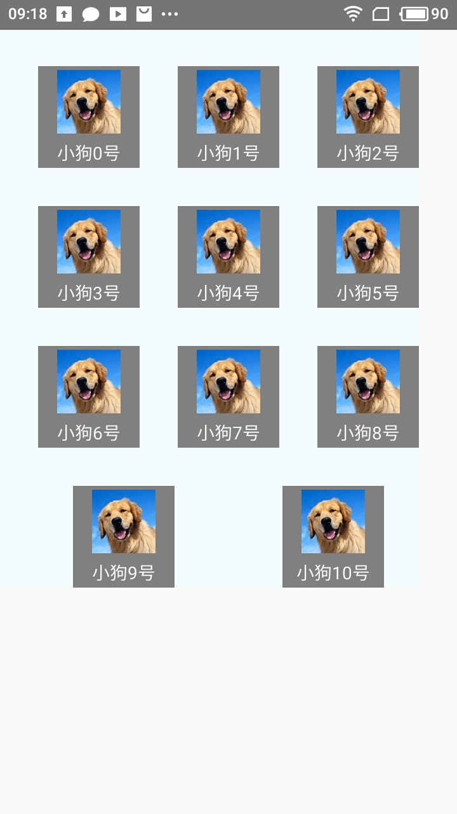
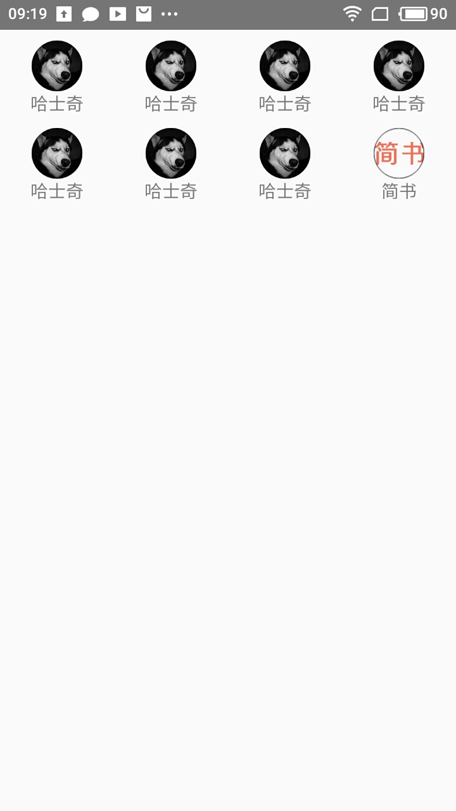
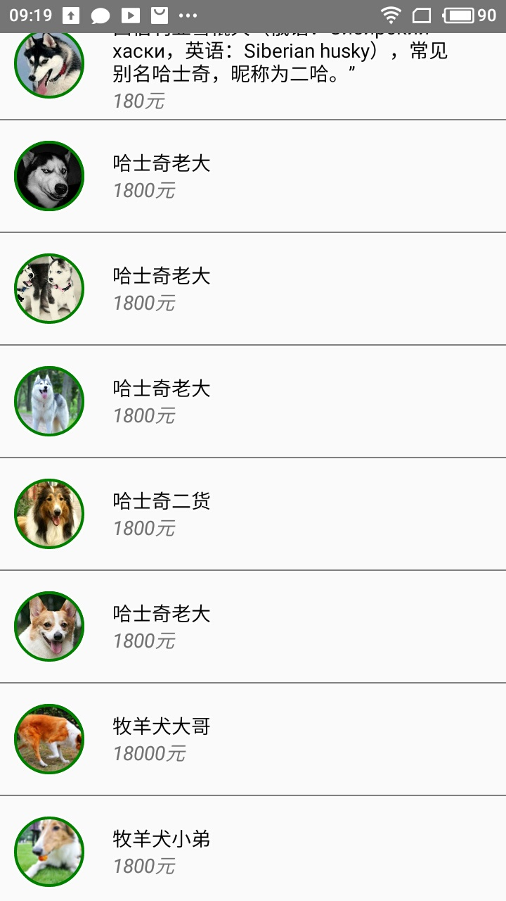

# ListView的使用

> 不管是Android还是ios，列表展示数据都是必须的，而且是最基本的<br/>
> **[warning] 此组件已过期 - 请使用FlatList或SectionList代替，虽然过期，但是还是要会使用的**

最基本的例子

```
constructor(props) {
  super(props);
  var ds = new ListView.DataSource({rowHasChanged: (r1, r2) => r1 !== r2});
  this.state = {
    dataSource: ds.cloneWithRows(['row 1', 'row 2']),
  };
}
render() {
  return (
    <ListView
      dataSource={this.state.dataSource}
      renderRow={(rowData) => <Text>{rowData}</Text>}
    />
  );
}
```

## ListView基本使用

### 数据源

1. 定义数据源,一般在状态机中

    ```
    constructor(props) {
      super(props);
      const ds = new ListView.DataSource({
        rowHasChanged:(r1,r2)=>{
            r1!==r2
        }
      });
      this.state = {
          dataSource: ds.cloneWithRows(listDataJson)
      };
    }
    ```
2. ListView至少制定两个属性

    * 数据源
    * 布局Item的View

    ```
    render() {
          return (
              <ListView
                  dataSource={this.state.dataSource}
                  renderRow={this.renderRow}
              />
          );
      }

    renderRow(rowData){
          return(
              <View>
                  <Image 
                    source={
                      {uri:rowData.imgUrl}
                    } 
                    style={styles.itemImage}/>
                  <Text style={styles.itemText}>{rowData.name}</Text>
              </View>
          )
    }
    ```

## ListView.DataSource

### 作用

1. `ListViewDataSource`为`ListView`组件提供高性能的数据处理和访问。我们需要调用方法从原始输入数据中抽取数据来创建ListViewDataSource对象，并用其进行数据变更的比较。原始输入数据可以是简单的字符串数组，也可以是复杂嵌套的对象——分不同区(section)各自包含若干行(row)数据。

2. 要更新datasource中的数据，请（每次都重新）调用cloneWithRows方法（如果用到了section，则对应cloneWithRowsAndSections方法）。数据源中的数据本身是不可修改的，所以请勿直接尝试修改。clone方法会自动提取新数据并进行逐行对比（使用rowHasChanged方法中的策略），这样ListView就知道哪些行需要重新渲染了。

3. 在下面这个例子中，一个组件在分块接受数据，这些数据由_onDataArrived方法处理——将新数据拼接（concat）到旧数据尾部，同时使用clone方法更新DataSource。我们使用concat方法来修改this._data以创建新数组，注意不能使用push方法拼接数组。实现_rowHasChanged方法需要透彻了解行数据的结构，以便提供高效的比对策略。

    ```
    constructor(props) {
      super(props);
      var ds = new ListView.DataSource({rowHasChanged: (r1, r2) => r1 !== r2});
      this.state = {
        ds,
      };
      this._data = []; 
    }

    _onDataArrived = (newData) => {
      this._data = this._data.concat(newData);
      this.setState({
        ds: this.state.ds.cloneWithRows(this._data)
      });
    };

    ```
4. 方法 `constructor(params)` 

    > 你可以在构造函数中针对section标题和行数据提供自定义的提取方法和hasChanged比对方法。如果不提供，则会使用默认的defaultGetRowData和defaultGetSectionHeaderData方法来提取行数据和section标题。

    > 默认的提取函数可以处理下列形式的数据:

    { sectionID_1: { rowID_1: rowData1, ... }, ... }

    或者：

    { sectionID_1: [ rowData1, rowData2, ... ], ... }

    或者：

    [ [ rowData1, rowData2, ... ], ... ]

    构造函数可以接受下列四种参数（都是可选）：

    ```
    getRowData(dataBlob, sectionID, rowID);
    getSectionHeaderData(dataBlob, sectionID);
    rowHasChanged(prevRowData, nextRowData);
    sectionHeaderHasChanged(prevSectionData, nextSectionData);
    cloneWithRows(dataBlob, rowIdentities) 
    ```
    根据指定的dataBlob和 rowIdentities为ListViewDataSource复制填充数据。dataBlob即原始数据。需要在初始化时定义抽取函数（否则使用默认的抽取函数）。

    rowIdentities是一个二维数组，包含了行数据对应的id标识符，例如[['a1', 'a2'], ['b1', 'b2', 'b3'], ...]。如果没有指定此数组，则默认取行数据的key。

    >**[danger]** 此方法实际并没有复制数据。它只是重新创建一个datasource，然后将你指定的dataBlob传递给构造函数中指定的提取函数，因而会抛弃先前的数据。如果你希望保留先前的数据，则必须先自行进行新老数据的合并处理，然后再将合并后的结果作为dataBlob传递给此方法调用。


## ListView.DataSource属性

1. cloneWithRowsAndSections(dataBlob, sectionIdentities, rowIdentities) 

    >此方法作用基本等同cloneWithRows，区别在于可以额外指定sectionIdentities 。如果你不需要section，则直接使用cloneWithRows即可。

    >sectionIdentities同理是包含了section标识符的数组。例如['s1', 's2', ...]。如果没有指定此数组，则默认取section的key。

    >**[warning] 返回新的对象**！

2. getRowCount() 

3. getRowAndSectionCount() 

4. rowShouldUpdate(sectionIndex, rowIndex) 

    返回值表明某行数据是否已变更，需要重新渲染。

5. getRowData(sectionIndex, rowIndex) 

    返回渲染行所需的数据（指定如何从原始dataBlob中提取数据）。

6. getRowIDForFlatIndex(index) 

    给定索引值，求其对应rowID。如果查找不到则返回null。

7. getSectionIDForFlatIndex(index) 

    给定索引值，求其对应sectionID。如果查找不到则返回null。

8. getSectionLengths() 

    返回一个数组，包含每个section的行数量。

9. sectionHeaderShouldUpdate(sectionIndex) 

    返回值用于说明section标题是否需要重新渲染。

10. getSectionHeaderData(sectionIndex) 

    获取section标题数据。


## ListView使用效果图

<center>
  
  
  
  
</center>

