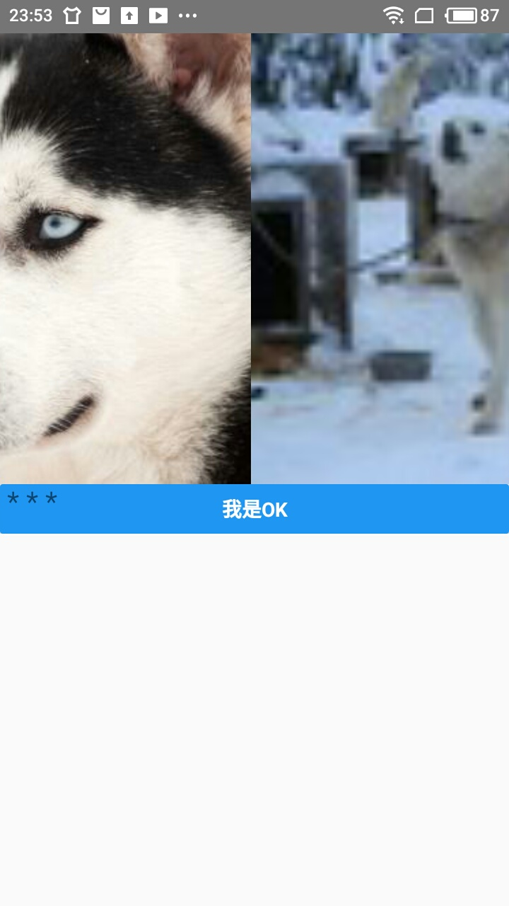
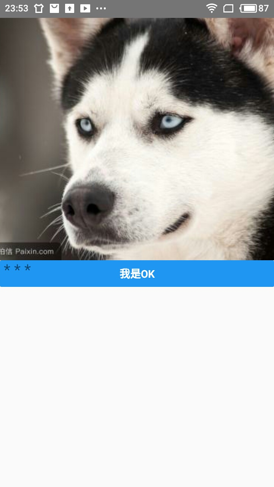

# ScrollView

## ScrollView属性

1. contentContainerStyle是样式对象类型的属性
2. horizontal是表示ScrollView子组件的方向
3. KeyboardDismissMode字符串属性,滑动时键盘是否隐藏
4. `onContentSizeChange`回调函数,当宽高改变时调用
5. `onSCroll`回调函数,滚动时调用
6. pageEnabled,true时ScrollView水平整页滚动,用来实现轮播
7. showsHorizontalScrollIndicator,滑动指示器是否显示
8. showsVerticalScrollIndicator,滑动指示器是否显示

> scrollView在Android和ios上有很多特有属性,需要的话自行查找

## 效果图

  
  

