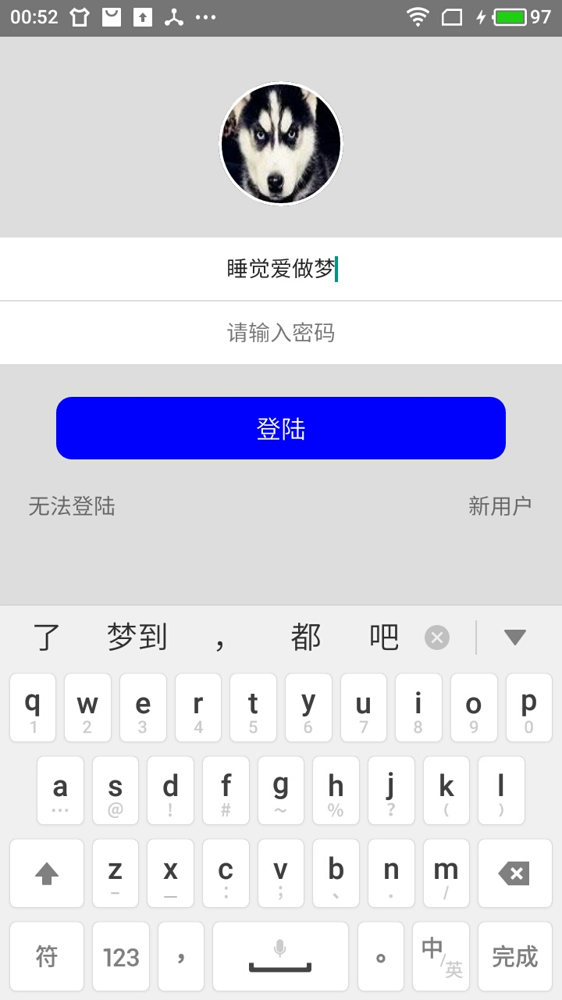

# TextInput组件

> 不要将此组件作为一个支持flexbox的盒子模型

## TextInput属性

1. placeholder:字符串属性,用户没有输入时展示的内容
2. placeholderTextColor:placeholder字体颜色
3. autofouce:是否自动获取焦点,boolean值
4. returnKeyType:TextInput获取焦点时,定义回车在键盘中布局的外表
5. 还有其他属性不一一列举

## IOS专有属性

1. clearButtonMode
2. clearTextOnFocus
3. enablesReturnKeyAutomatically
4. keyboardAppearance
5. onKeyPress
6. spellCheck

## Android专有属性

1. numberOfLines
2. disableFullscreenUI
3. inlineImageLeft
4. inlineImagePadding
5. returnKeyLabel
6. underlineColorAndroid

## 生命周期

1. 用户输入`onChangeText`回调函数执行
2. 用户按下提交`onSubmitEditing`函数执行
3. 失去焦点:失去焦点事件在某些情况下可能不会发生,一般还是在`onChangeText`中处理失焦事件,`onEndEditing`或者`onBlru`有可能不回调
4. `onContentSizeChange`回调函数在TextInput组件的字符行数变化时回调
5. `onSelectionChange`在TextInput选中字符被改变时回调

## TextInput字体居中

> 需要设置padding属性为0,否则无法居中

## TextInput使用效果

  

