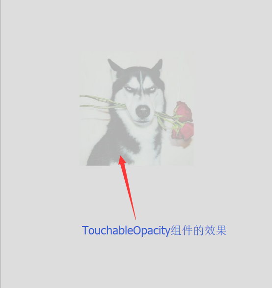

# 可触摸组件

> TouchableNativeFeedback、TouchableWithoutFeedback、TouchableHighlight和TouchableOpacity，其中TouchableOpacity用的居多

## TouchableNativeFeedback

> Android系统专有，有ripple效果

## TouchableOpacity

> 触摸时，会变成半透明的

1. activeOpacity定义了透明的值，取值从0-1

## TouchableHight

> 触摸会有变暗的效果

## 简易使用效果图

  

