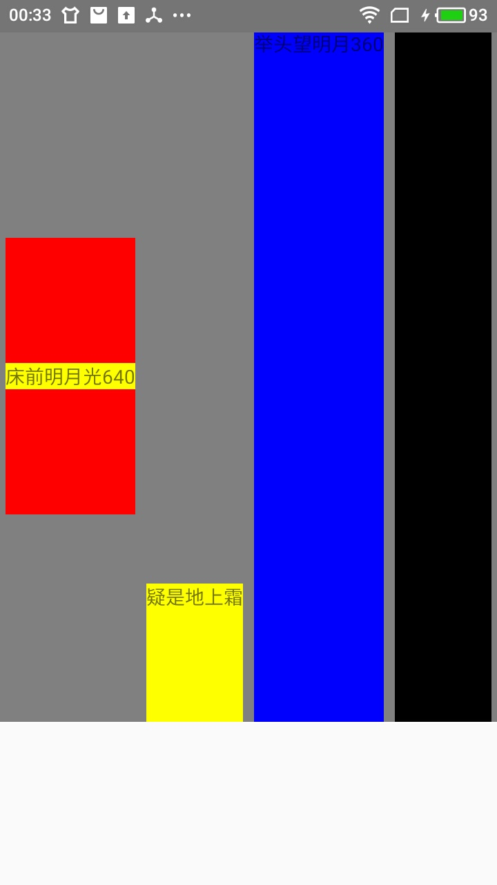

# 弹性布局

## 位置宽、高样式

### releative

1. 不可以用bottom和right键描述位置
2. top和left表示当前组件距离上一个同级组件之间的距离有多少pt

### absolute

1. top、bottom、left、right四个键表示距离父组件的上下左右有多少pt

### 与宽高有关的键值

```
width,height,maxHeight,maxWidth,minHeight,minWidth
```

## flex布局

### flexDriection

> flexDirection有四个值，row，row-reverse，column，column-reverse，默认取值是column

1. row:水平
2. row-reverse:水平方向反转
3. column:竖直
4. column-reverse:竖直方向反转

### flexWrap

> 表示的是是否自动换行，有两个取值wrap和nowrap

1. wrap：自动换行
2. nowrap：不自动换行

### justifyContent键

> 定义再一个方向上如何排列子组件，即:主轴的方向，取值有flex-start,flex-end,space-between,space-around

### alignItems键

> 定义侧轴方向的排列，有：flex-start，flex-end，center，stretch

### flex

> flex是flex-grow、flex-shrink、flex-basis三个属性，默认值是0,取值可以是-1，0或者任意正数，为非0时，自动缩放剩下的空间，height和width会失效

### alignSelf

> 定义自己在父布局上的侧轴方向,可以覆盖父布局的alitItem属性,有auto,flex-start,flex-end,center,strech

## 边框空隙与填充

### 边框

> borderWidth、borderTopWidth、borderRightWidth、borderBottomWidth、borderLeftWidth,表示边框的宽度

### 填充宽度

> 填充宽度用的是padding

1. paddingHorizontal是水平方向有效
2. paddingVertical是垂直方向有效
3. paddingBottom、paddingLeft、paddingRight、paddingTop见名知意

### 空隙宽度

> 与padding类似,有marginHorizontal、marginVertical、marginBottom、marginLeft、marginRight、marginTop

## 组件样式

1. 定义

  ```
  const styles = StyleSheet.create({
    container:{
      flex:1,
      flexDirection:'row'
    }
  })
  ```
  
2. 使用

  ```
  style={styles.container}
  ```

3. 行内样式使用

  ```
  style = {
    {
      background:'red'
    }
  }
  ```

## flexbox简易使用效果图

<center>
  
</center>
